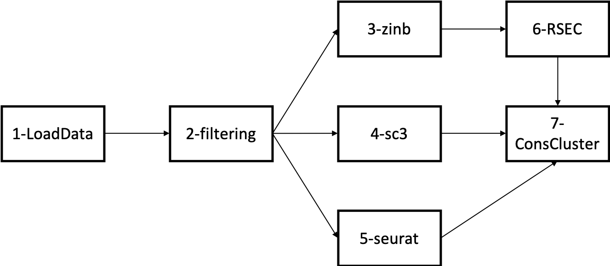

# Pipeline to analyse the allen datasets

We have four datasets:

+ SMARTer_cells_MOp
+ SMARTer_nuclei_MOp
+ 10x_cells_MOp
+ 10x_nuclei_MOp

The scripts used to run the analysis can be found in the Script folder.

We follow this workflow:

Reports can be generated by running the script render.sh in the Report folder. 

As of 03/12, only reports for the two Smart-Seq datasets are available.
