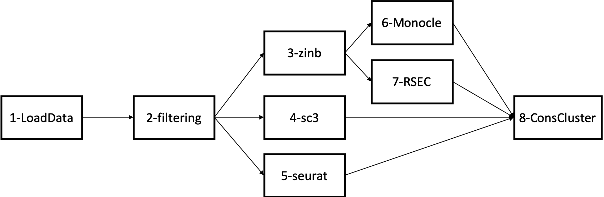

```{r packages, include=F}
library(knitr)
opts_chunk$set(
  fig.pos = "!h", out.extra = "", warning = F, message = F,
  fig.width = 5, fig.align = "center", echo = F
)
libs <- c("here", "tidyverse", "cowplot")
suppressMessages(
  suppressWarnings(sapply(libs, require, character.only = TRUE))
)
rm(libs)

source(here("Scripts", "Smart-Seq", "7-helper.R"))

mergers_cells <- readRDS(here("data", "Smart-Seq",
                              "SMARTer_cells_MOp_mergers.rds"))
mergers_nuclei <- readRDS(here("data", "Smart-Seq",
                               "SMARTer_nuclei_MOp_mergers.rds"))

mergers_cells_no_allen <- readRDS(here("data", "Smart-Seq",
                                       "SMARTer_cells_MOp_no_allen_mergers.rds"))
mergers_nuclei_no_allen <- readRDS(here("data", "Smart-Seq",
                                        "SMARTer_nuclei_MOp_no_allen_mergers.rds"))
```

# General comments

We have the following workflow



In the Seurat clustering, there are two parameters to choose from: the resolution and the k.param (use in a knn step). From the seurat help file, for the resolution parameter: use a value above (below) 1.0 if you want to obtain a larger (smaller) number of communities.

We picked a value of 1.6 as we want many clusters to start with. We also pick k = 50. Those values seem intermediate in term of ARI with other pairs of paramters (see section Seurat ARI param)

We also consider two ways of computing the ARI between RSEC and other methods. Either, we force RSEC to assign all cells to a given cluster, or we only compute the ARI between RSEC and the other methods on those cells that RSEC do cluster. Note that in the second case, other pairs of methods are compared using all cells. We denote as RsecT the cluster assignement where all cells are assigned (i.e Rsec Total). 

# Consensus clustering with the Allen dataset
## Smart-Seq MOp cells
### Reduction in the number of clusters
```{r}
pre <- apply(mergers_cells$initalMat, 2, function(x) length(unique(x)))
post <- apply(mergers_cells$currentMat, 2, function(x) length(unique(x)))
df <- data.frame(methods = names(pre),
                 before = pre,
                 after = post) %>%
  gather(key = "time", value = "Nb", -methods) %>%
  mutate(time = factor(time, levels = c("before", "after")))
p <- ggplot(df, aes(x = methods, y = Nb, fill = time)) +
  geom_bar(stat = "identity", position = "dodge") +
  theme_classic() +
  scale_fill_viridis_d(option = "E") +
  labs(x = "Clustering Methods", y = "Number of clusters", fill = "") +
  ggtitle("Reduction in number of clusters with consensus merging")
p
rm(pre, post, df, p)
```

### Improvement in ARI

```{r}
Init1 <- here("Figures", "Smart-Seq", "SMARTer_cells_MOp_Initial_ARI.pdf")
Init2 <- here("Figures", "Smart-Seq", "SMARTer_cells_MOp_Initial_ARI_all_cells_Assigned.pdf")
Final1 <- here("Figures", "Smart-Seq", "SMARTer_cells_MOp_Final_ARI.pdf")
Final2 <- here("Figures", "Smart-Seq", "SMARTer_cells_MOp_Final_ARI_all_cells_Assigned.pdf")
plot_grid(ggdraw() + draw_image(Init1, scale = 1),
          ggdraw() + draw_image(Init2, scale = 1),
          ggdraw() + draw_image(Final2, scale = 1),
          ggdraw() + draw_image(Final2, scale = 1),
          ncol = 2)
rm(Init1, Init2, Final1, Final2)
```

## Smart-Seq MOp nuclei
### Reduction in the number of clusters
```{r}
pre <- apply(mergers_nuclei$initalMat, 2, function(x) length(unique(x)))
post <- apply(mergers_nuclei$currentMat, 2, function(x) length(unique(x)))
df <- data.frame(methods = names(pre),
                 before = pre,
                 after = post) %>%
  gather(key = "time", value = "Nb", -methods) %>%
  mutate(time = factor(time, levels = c("before", "after")))
p <- ggplot(df, aes(x = methods, y = Nb, fill = time)) +
  geom_bar(stat = "identity", position = "dodge") +
  theme_classic() +
  scale_fill_viridis_d(option = "E") +
  labs(x = "Clustering Methods", y = "Number of clusters", fill = "") +
  ggtitle("Reduction in number of clusters with consensus merging")
p
rm(pre, post, df, p)
```

### Improvement in ARI

```{r}
Init1 <- here("Figures", "Smart-Seq", "SMARTer_nuclei_MOp_Initial_ARI.pdf")
Init2 <- here("Figures", "Smart-Seq", "SMARTer_nuclei_MOp_Initial_ARI_all_cells_Assigned.pdf")
Final1 <- here("Figures", "Smart-Seq", "SMARTer_nuclei_MOp_Final_ARI.pdf")
Final2 <- here("Figures", "Smart-Seq", "SMARTer_nuclei_MOp_Final_ARI_all_cells_Assigned.pdf")
plot_grid(ggdraw() + draw_image(Init1, scale = 1),
          ggdraw() + draw_image(Init2, scale = 1),
          ggdraw() + draw_image(Final1, scale = 1),
          ggdraw() + draw_image(Final2, scale = 1),
          ncol = 2)
```

# Consensus clustering without the Allen dataset
## Smart-Seq MOp cells
### Reduction in the number of clusters
```{r}
pre <- apply(mergers_cells_no_allen$initalMat, 2, function(x) length(unique(x)))
post <- apply(mergers_cells_no_allen$currentMat, 2, function(x) length(unique(x)))
df <- data.frame(methods = names(pre),
                 before = pre,
                 after = post) %>%
  gather(key = "time", value = "Nb", -methods) %>%
  mutate(time = factor(time, levels = c("before", "after")))
p <- ggplot(df, aes(x = methods, y = Nb, fill = time)) +
  geom_bar(stat = "identity", position = "dodge") +
  theme_classic() +
  scale_fill_viridis_d(option = "E") +
  labs(x = "Clustering Methods", y = "Number of clusters", fill = "") +
  ggtitle("Reduction in number of clusters with consensus merging")
p
rm(pre, post, df, p)
```

### Improvement in ARI

```{r}
Init1 <- here("Figures", "Smart-Seq",
              "SMARTer_cells_MOp_no_allen_Initial_ARI.pdf")
Init2 <- here("Figures", "Smart-Seq",
              "SMARTer_cells_MOp_no_allen_Initial_ARI_all_cells_Assigned.pdf")
Final1 <- here("Figures", "Smart-Seq",
               "SMARTer_cells_MOp_no_allen_Final_ARI.pdf")
Final2 <- here("Figures", "Smart-Seq",
               "SMARTer_cells_MOp_no_allen_Final_ARI_all_cells_Assigned.pdf")
plot_grid(ggdraw() + draw_image(Init1, scale = 1),
          ggdraw() + draw_image(Init2, scale = 1),
          ggdraw() + draw_image(Final1, scale = 1),
          ggdraw() + draw_image(Final2, scale = 1),
          ncol = 2)
rm(Init1, Init2, Final1, Final2)
```

### Comparison with Allen subclass

```{r}
allen_clusters_cells <- read.csv(here("data", "Smart-Seq",
                                      "SMARTer_cells_MOp_cluster.membership.csv"),
                                 col.names = c("cells", "cluster_id"))
clusters_cells <- read.csv(here("data", "Smart-Seq",
                                      "SMARTer_cells_MOp_cluster.annotation.csv"),
                           header = T)
allen_clusters_cells <- full_join(allen_clusters_cells, clusters_cells)


InitialARI <- apply(clusMatT, 2, function(x) {
  apply(clusMatT, 2, function(y) {
    mclust::adjustedRandIndex(x, y)
  })
})
```

## Smart-Seq MOp nuclei
### Reduction in the number of clusters
```{r}
pre <- apply(mergers_nuclei_no_allen$initalMat, 2, function(x) length(unique(x)))
post <- apply(mergers_nuclei_no_allen$currentMat, 2, function(x) length(unique(x)))
df <- data.frame(methods = names(pre),
                 before = pre,
                 after = post) %>%
  gather(key = "time", value = "Nb", -methods) %>%
  mutate(time = factor(time, levels = c("before", "after")))
p <- ggplot(df, aes(x = methods, y = Nb, fill = time)) +
  geom_bar(stat = "identity", position = "dodge") +
  theme_classic() +
  scale_fill_viridis_d(option = "E") +
  labs(x = "Clustering Methods", y = "Number of clusters", fill = "") +
  ggtitle("Reduction in number of clusters with consensus merging")
p
rm(pre, post, df, p)
```

### Improvement in ARI

```{r}
Init1 <- here("Figures", "Smart-Seq",
              "SMARTer_nuclei_MOp_no_allen_Initial_ARI.pdf")
Init2 <- here("Figures", "Smart-Seq",
              "SMARTer_nuclei_MOp_no_allen_Initial_ARI_all_cells_Assigned.pdf")
Final1 <- here("Figures", "Smart-Seq",
               "SMARTer_nuclei_MOp_no_allen_Final_ARI.pdf")
Final2 <- here("Figures", "Smart-Seq",
               "SMARTer_nuclei_MOp_no_allen_Final_ARI_all_cells_Assigned.pdf")
plot_grid(ggdraw() + draw_image(Init1, scale = 1),
          ggdraw() + draw_image(Init2, scale = 1),
          ggdraw() + draw_image(Final1, scale = 1),
          ggdraw() + draw_image(Final2, scale = 1),
          ncol = 2)
```


# Seurat ARI Param
## Smart-Seq MOp cells

```{r}
ggdraw() + draw_image(here("Figures", "Smart-Seq",
                           "SMARTer_cells_MOp_seurat_ARI.pdf"))
```

## Smart-Seq MOp nuclei

```{r}
ggdraw() + draw_image(here("Figures", "Smart-Seq",
                           "SMARTer_nuclei_MOp_seurat_ARI.pdf"))
```
