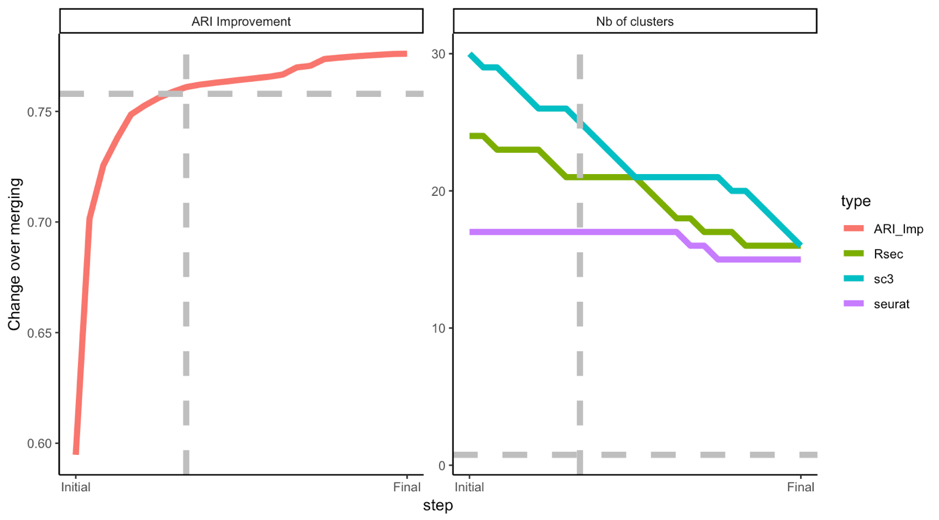

# Explanation of how to produce those files

Each dataset has an individual file: 

Each file consists of the cluster results from sc3, Seurat, RSEC and the consensus of the three at the following steps: before our merging procedure, at 90% of the procedure (in term on the improvement of the metric) and after the final run of our metric. 

The ARI merging method works as follow. We iterate over all pairs of clusters for every clustering method. For each pair, we try to merge the two clusters and see how it improves the ARI with the other methods. We then merge the pair that improves the ARI the most. We stop when the ARI cannot be improved anymore.

In the general case, we perform the ARI merging without the Allen labels and we then use it as a comparison.

The figure below illustrates the improvement in the mean ARI between methods, as well as the reduction in the number of clusters at each step for the Smart-Seq nuclei dataset.  The grey dashed line corresponds to $90\%$ of the total ARI improvement, which we use as the intermediate_90 step. Likewise, the intermediate_33 and intermediate_66 matches the corresponding ARI improvements (not plotted).

The script to reproduce this can be found in *Scripts/Helper/dataForJessie.R*. The reports for the individual datasets are in the __Report__ folder.
